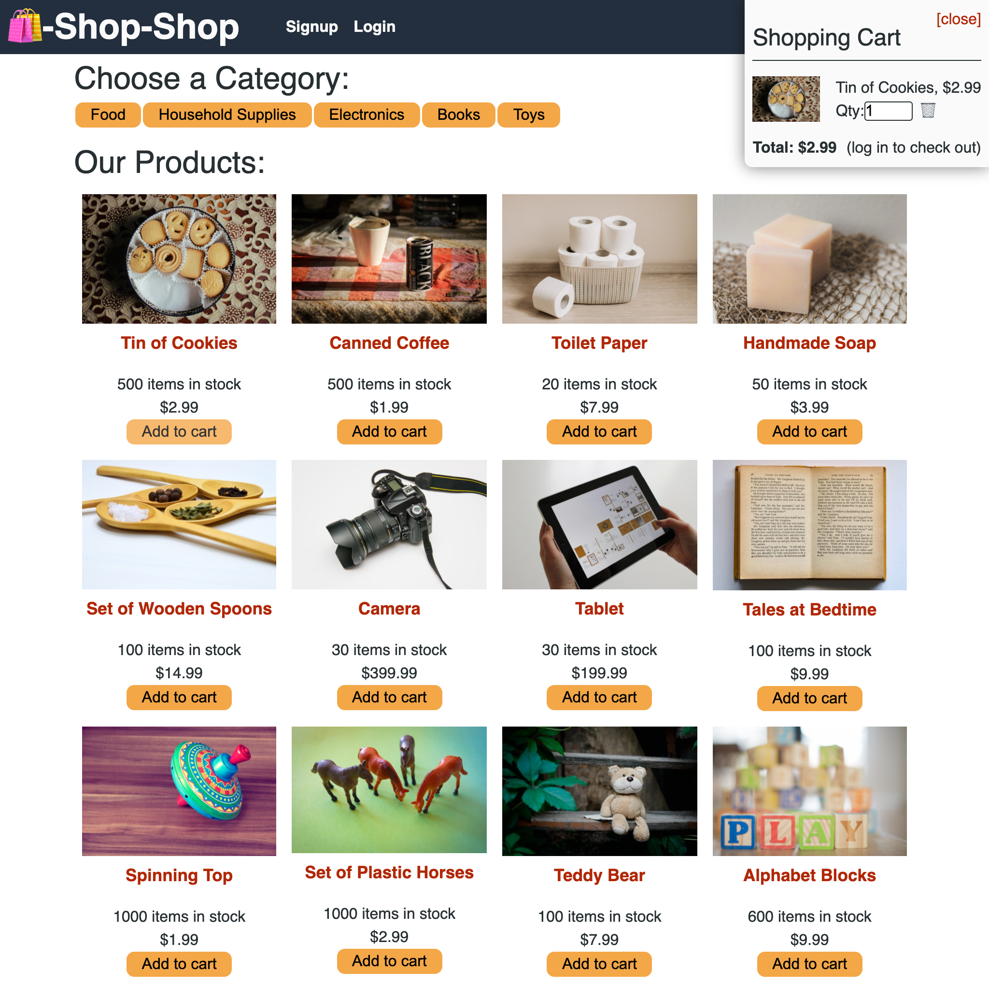

# ReduxStore

Link to deployed site on Heroku: https://buyshop.herokuapp.com/

## Description
This MERN stack e-commerce store was refactored to use Redux to manage the global state instead of the Context API. This site allows user to shop for different categories of items. If no account exists then they can sign-up and add items to their cart. Users are also able to view ther order history. The site uses a Stripe API to test checkout items. In the future, I would like to add different items and change the format. 

## Table of Contents
- [Installation](#installation)
- [Usage](#usage)
- [Contributing](#contributing)
- [Screenshots](#screenshots)
- [License](#license)
- [Questions](#questions)
- [Acknowledgments](#acknowledgments)

### Installation
After downloading this repository, go into the folder of this project. Then run npm install or i. 

### Usage
Make sure to have MongoDB installed. Then you can run npm develop to run the application and create a production build. Use npm run seed to add the store products and user profile. You can also use a program such as ROBO 3T to view the MongoDB collection. You can also visit the Heroku link above to see the deployed site. 

### Contributing
Feel free to fork or clone this repo and make your own versions.

## Screenshots

### Desktop view

### Mobile View

### Questions

Send questions to edort93@gmail.com or visit <a href="https://github.com/edgarO93" target= "_blank" >my profile </a> 

## License
This project is licensed under the terms of the MIT license.

## Acknowledgments
~~~
I would like to thank online resources such as W3 schools, MDN Web Docs, and Stack Overflow.
~~~
